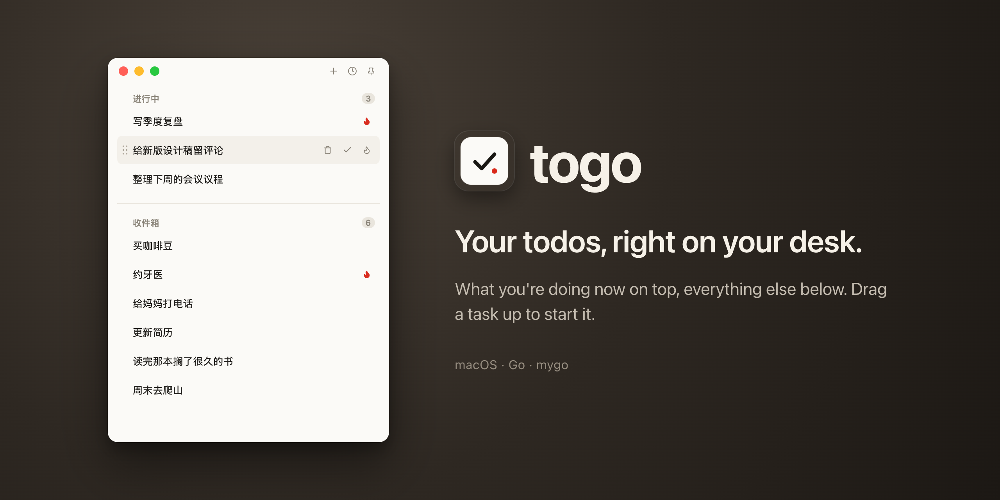

# togo

A todo window that lives on your macOS desk. Built with Go and the native UI of
[mygo](https://github.com/egoist/mygo): no webview, no web page in a wrapper.



There is one column, split into two. "进行中" at the top holds what you are
actually working on right now; "收件箱" underneath is where everything else
lands as you think of it. To start something, drag it up.

> The interface is in Simplified Chinese. Everything else here — code,
> comments, this file — is in English.

## The idea

- **One sheet of paper.** The whole window is a single warm off-white, so empty
  space reads as room rather than as something unfinished. The two sections are
  told apart by their headings and scroll together. Only the
  completed-tasks popover and the row under the cursor during a drag leave that
  plane.
- **One colour, one job.** Red means priority. Nothing else gets a hue.
- **Checking something off takes two steps.** The row is struck through and
  holds still for 240 ms — click again in that window and it comes back — then
  it folds shut, and only then is the change written.
- **Actions hide until you reach for them.** Hover a row and its actions appear
  at the right; the title dissolves under them rather than being cut off.
- **Destructive buttons need two clicks.** Delete and "clear completed" are
  armed by the first click and disarm themselves three seconds later.

## Keyboard

| Shortcut | Action |
| --- | --- |
| `⌘N` | New task |
| `⇧⌘P` | Keep the window on top |
| `⇧⌘H` | Show / hide completed |
| `⌘⌫` | Delete the task under the pointer |
| `Esc` | Cancel the current input |

`⌘⌫` does nothing to tasks while you are editing a title — there it means
"delete to the start of the line".

## What it remembers

Everything lives in `~/Library/Application Support/togo/`: the tasks in
`todo.db` (SQLite, created on first launch), and the window's position, size
and pin in two small JSON files, so it reopens the way you left it. A build run
outside the bundle, as `go run .`, keeps its own directory named after its
binary. To try a build against a copy of your tasks:

```bash
TOGO_DB=/tmp/todo.db go run .
```

## Build and run

Go is pinned by mise (`.mise.toml`), mygo by `go.mod`.

```bash
go run .
```

To get the app itself — a Dock icon and a name in the menu bar:

```bash
go tool mygo build -skip-dmg
```

It writes `build/darwin-arm64/togo.app`, ad-hoc signed so it launches on Apple
silicon.

## Tests

```bash
go test ./...
```

The interface tests drive the view without a window through `ui.NewTester`,
with a clock the tests advance by hand. `SNAP=<dir> go test -run TestSnapshots`
writes PNGs of the main states, and `TOGO_BANNER=1 go test -run TestBanner`
regenerates the banner (it needs Google Chrome).

## License

MIT — see [LICENSE](LICENSE).
